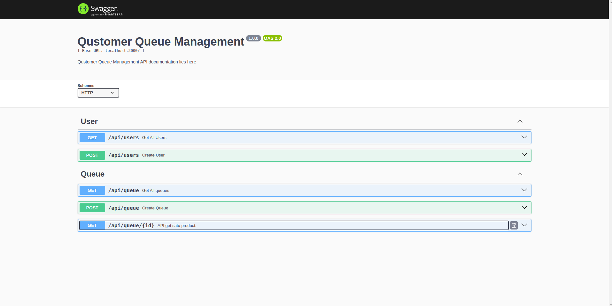
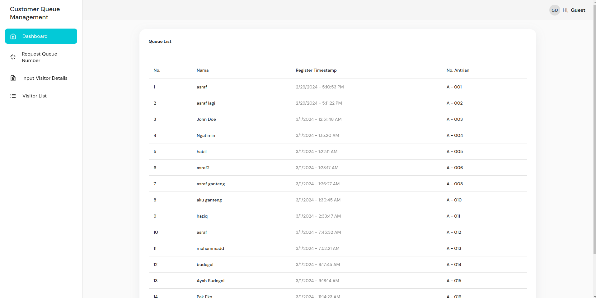
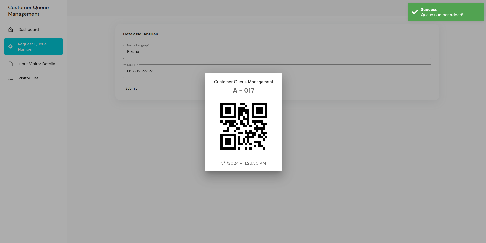
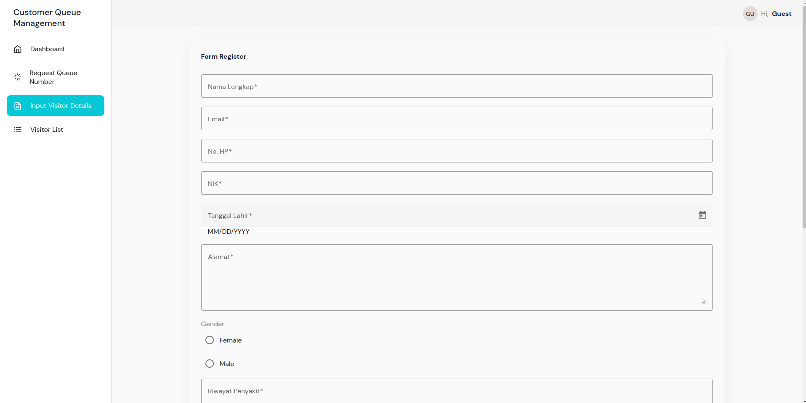
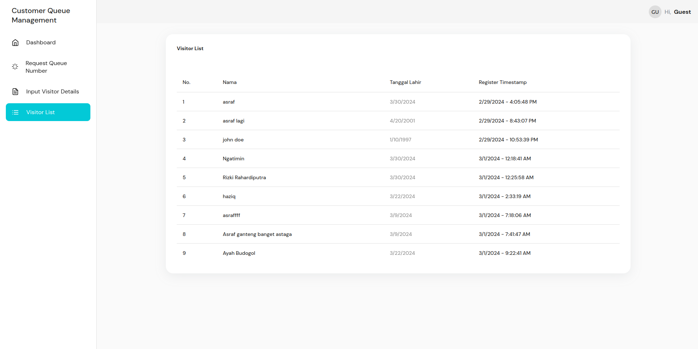

# prieds-technical-test

## Prerequisites
- NodeJS v18+
- Angular V16+

## How to Run the Project
- You need to run both, frontend and backend
### Frontend
- cd frontend
- yarn install
- yarn start
- visit http://localhost:4200
### Backend
- cd backend
- yarn install
- yarn start
- visit http://localhost:3000/api-docs for the API documentation

## Testing
- cd backend // still only backend for testing:(
- yarn test

## Pages
### API Documentation

### Queue List

### Print Queue

### Register Visitor

### Visitor List
